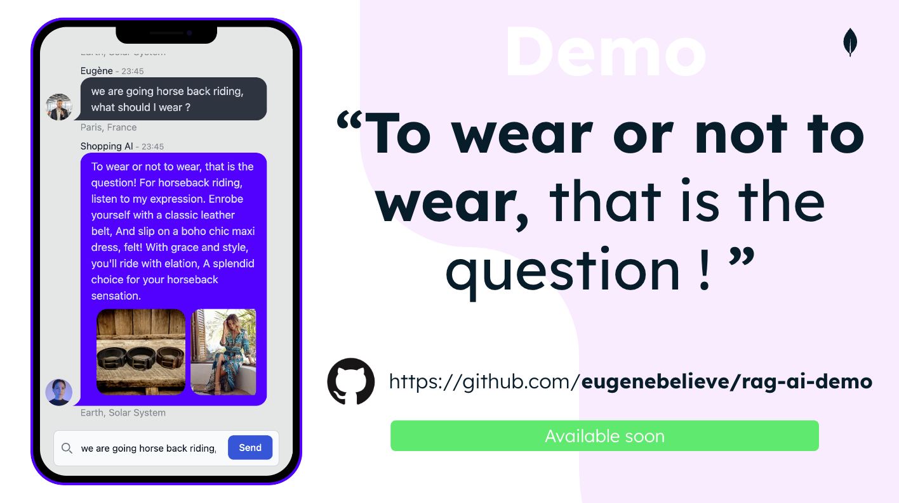
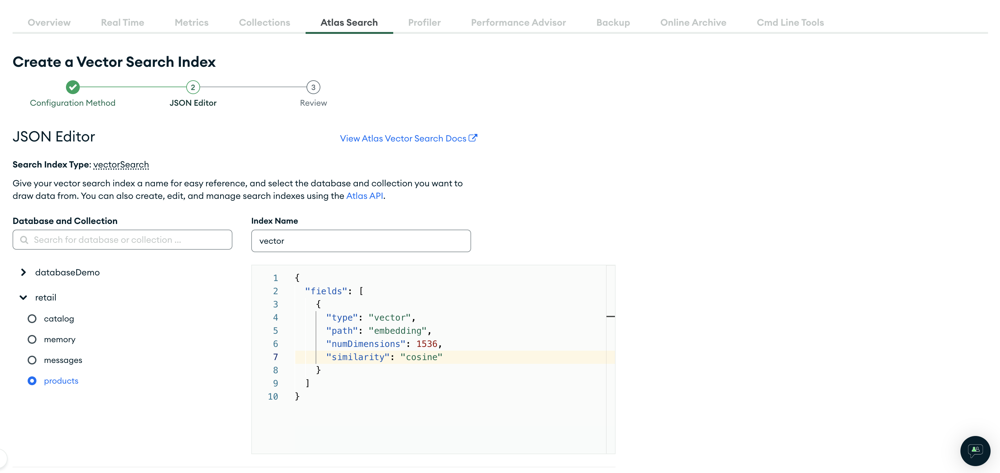

# RAG Demo using OpenAI and Atlas Vector Search<br />

Following the Webinar on AI, you will find the RAG demo and the steps to set it up.



### What's the Stack ?

This is a <b>Demo</b> in which we will be demonstrating RAG with Langchain, MongoDB, Atlas Vector Search. The demo is build on React and NodeJS.

### Folder Achitecture

- Folder "frontend" -> React Application
- Folder "backend" -> NodeJS Backend
- File "backend/routes/RagFunction.js" -> RAG Function

---

# Installation

### Cluster and Index setup on MongoDB Atlas

0. Create an account on MongoDB Atlas (if you don't have one): `https://www.mongodb.com/`
1. Create a Cluster and a Database named `"retail"`
2. Create a collection called `"products"` (inside the "retail" database) and import the dataset.json (from root folder)
3. Create a vector index named `"vector"` on the database and collection `"retail > products"` and in the JSON Editor, here is the input :

```JSON
{
  "fields": [
    {
      "numDimensions": 1536,
      "path": "embedding",
      "similarity": "cosine",
      "type": "vector"
    }
  ]
}
```

### What it should look like :



---

### Setup your backend envrionnement Variables

1. Go to backend and open the file `.env`
2. Complete the following fields

```JS
OPENAI_API_KEY="<your-openai-api-key>"
MONGODB_ATLAS_URI="mongodb+srv://username:password@<your-atlas-connection-string>"
DATABASE_NAME="retail"
```

FYI : the database name is a envrionment variable, you can change it if you wish

### Frontend and Backend Setup

1. In Root folder execute `"npm i"`
2. In "frontend" folder execute `"npm i"`
3. In "frontend" folder execute `"npm i"`

### Run the code

- From Root folder execute `"npm run start"`

---

### Dataset is available inside the root folder and here is the schema for the dataset (FYI)

```JSON
 [
  {
    "_id": "ObjectId",
    "name": "Product Name",
    "description": "Product Description",
    "embedding": []
  }
]
```

### USAGE

To connect to the application : `localhost:3000` to see the frontend and the backend should be running on `localhost:8000`

## This is a first Version of the documentation, I will update it in the coming days with more details
